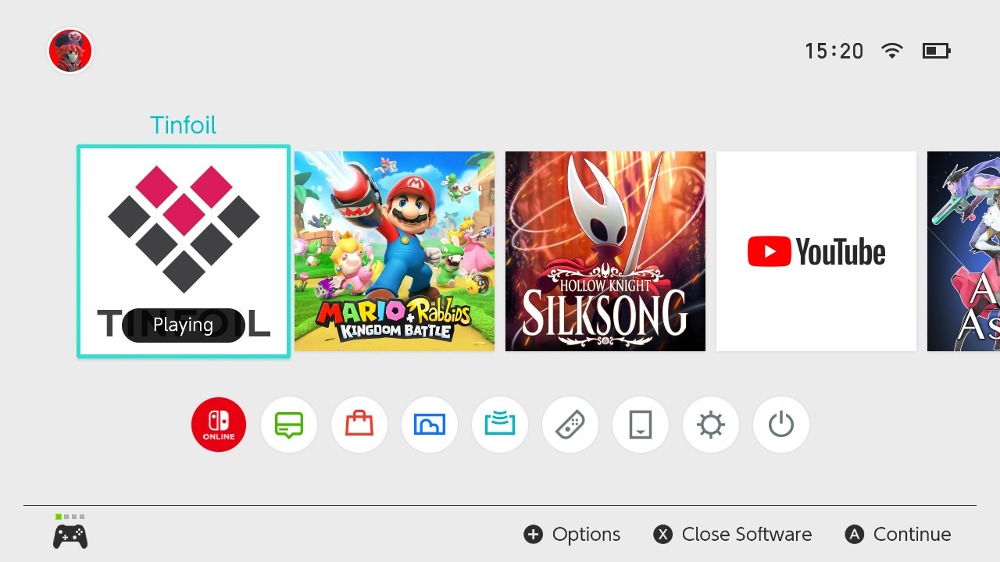
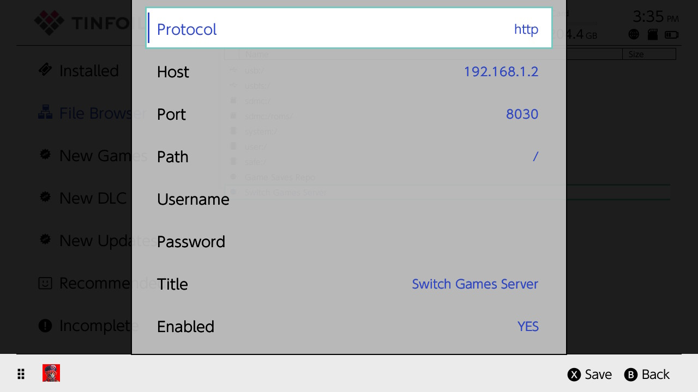
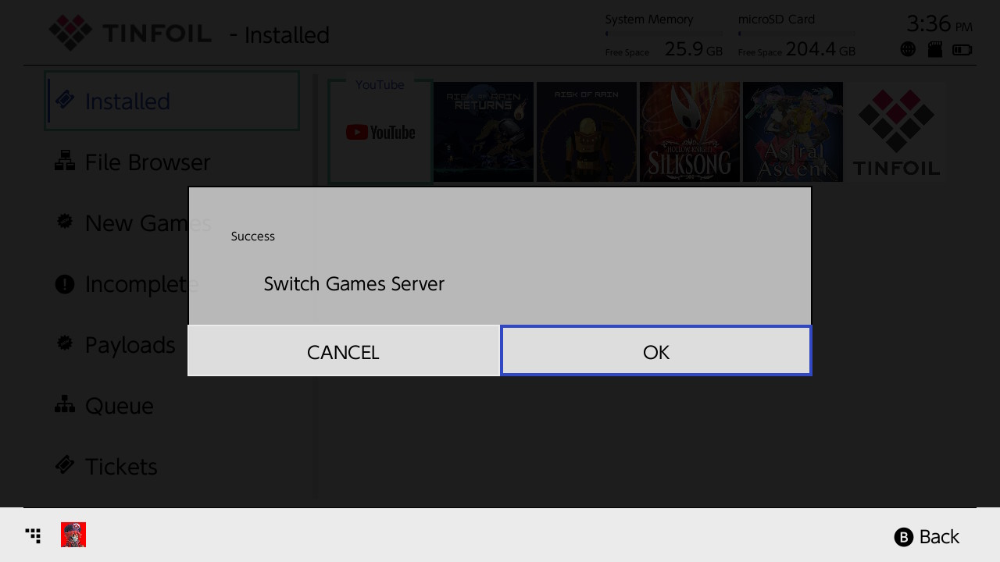
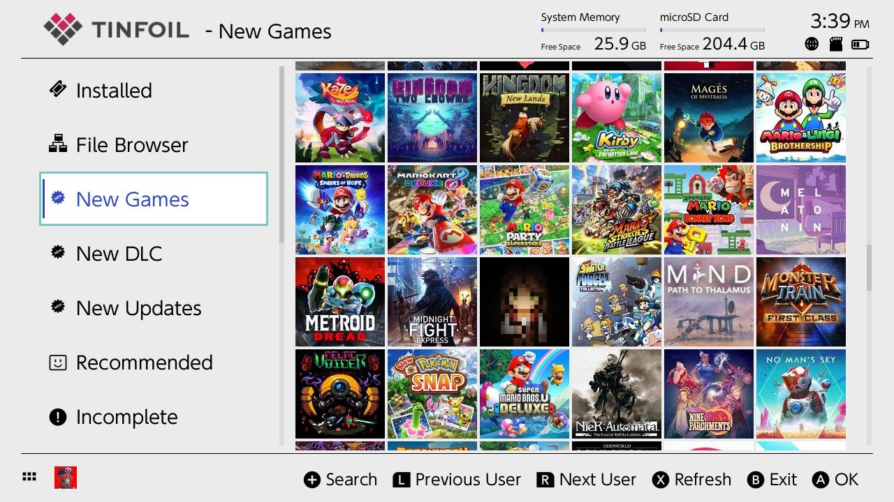

# Tinfoil Setup Guide

Setup SGS with Tinfoil on your Nintendo Switch.

## Prerequisites

- Nintendo Switch with CFW
- Tinfoil installed
- SGS server running
- SGS should be on the same network that your Nintendo Switch

## Instructions

1. **Find Server IP** - Run `ip addr show` (Linux), `ipconfig` (Windows), or `ifconfig` (macOS)
2. **Open Tinfoil** - Launch on your Switch


3. **Add Source** - Go to File Browser → Press the ➖ button add a new source
4. **Configure**:
   - Protocol: `http`
   - Host: `YOUR_IP`
   - Port: `8030`
   - Path: `/` or `/api/tinfoil`
   - Title: `Switch Games Server`
   - Enabled: `Yes`

5. **Save**: Press X to save

6. **Success**: You should see a success message with the text `Switch Games Server`


7. **Browse**: Depending on the content you've placed on the `games` directory, it should appear on `New Games`, `New DLC` or `New Updates`


## Troubleshooting

- **Connection Failed**: Check network, firewall, server running
- **No Games**: Verify files in `games/` folder with correct extensions

## API Format

```json
{
  "files": [
    {"url": "http://YOUR_IP:8030/games/example1.nsz", "size": 123456},
    {"url": "http://YOUR_IP:8030/games/example2.nsz", "size": 123456}
  ],
  "success": "Switch Games Server"
}
```
